# 商家中心

### 基本信息

该页面主要管理登录商家的基础安全信息以及最佳登录历史查看。

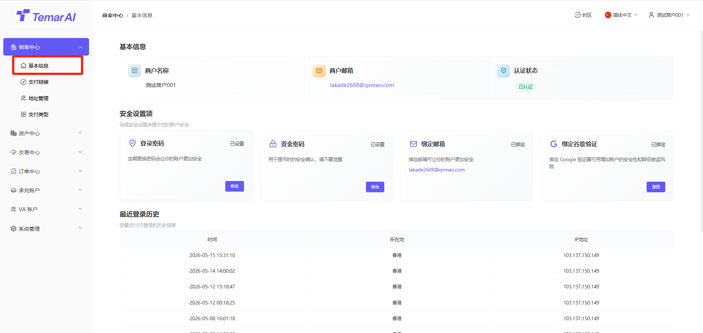

资料审核管理
- 功能描述：提交资料平台审核，当未提交资料时，权限较少。
- 操作步骤：
- 点击“认证”
- 填写企业信息
- 填写联系人信息
- 提交审核
- 审核通过后，获得更多权限

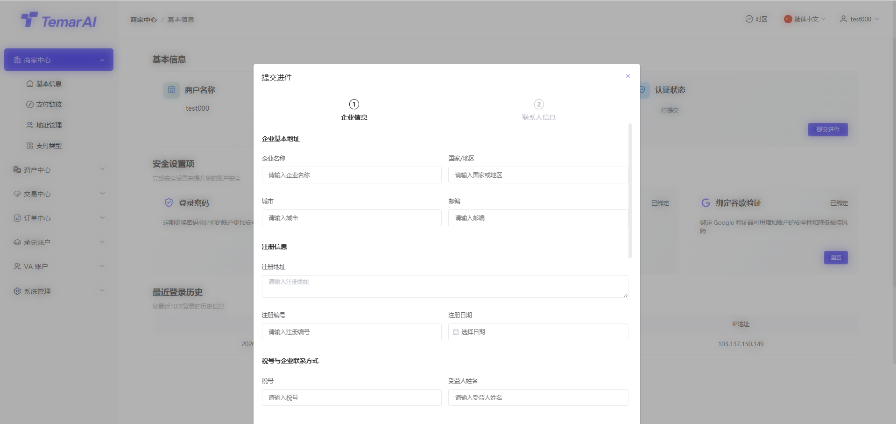

登录密码管理
- 功能描述：修改登录商家后台的密码。
- 操作步骤：
- 点击“修改登录密码”。
- 设置新登录密码（输入长度为8-18，数字字母大小写符号组合的密码）。
- 再次输入新密码确认。
- 输入邮件验证码/谷歌验证码进行身份验证。
- 点击“确定”，密码修改即时生效。

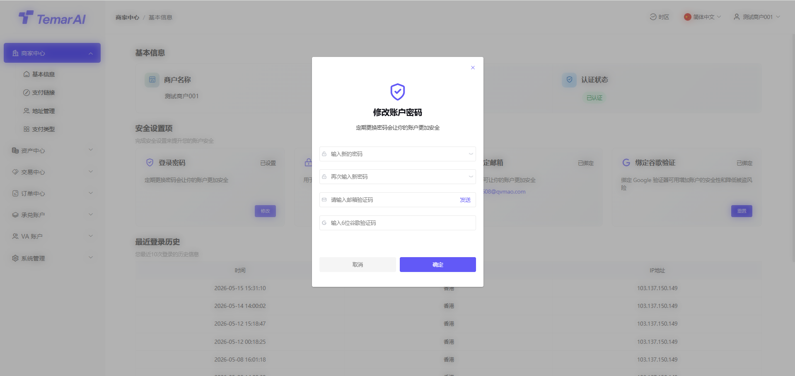

资金密码管理
- 功能描述：设置或修改用于提现等资金操作时的二次验证密码。
- 操作步骤：
- 点击“修改资金密码”。
- 设置新资金密码（输入长度为8-18，数字字母大小写符号组合的密码）。
- 再次输入新密码确认。
- 输入邮件验证码/谷歌验证码进行身份验证。
- 点击“确定”，密码修改即时生效。

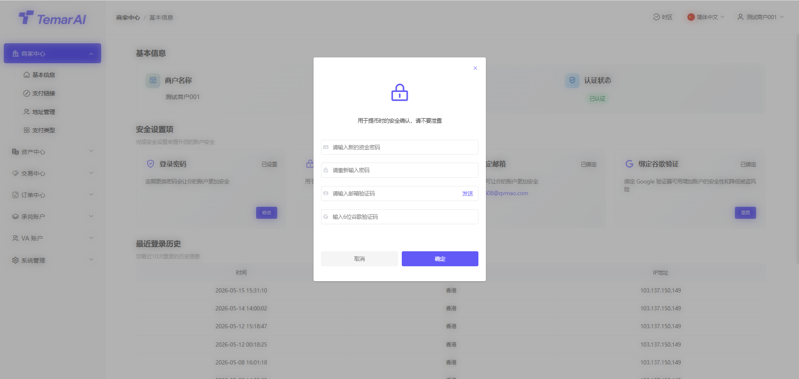

谷歌验证器绑定
- 功能描述：绑定谷歌验证器（Google Authenticator），为登录或关键操作增加动态口令（MFA）保护。默认首次登录必须绑定。
- 如忘记原谷歌验证码，请联系平台进行重置。
- 操作步骤：
- 点击“重置谷歌验证器”。
- 使用谷歌验证器APP扫描页面上显示的二维码。
- APP将生成一个6位动态验证码。
- 在页面输入框内填写该验证码。
- 点击“下一步”，进行安全验证。
- 输入邮件验证码/原谷歌验证码进行身份验证。
- 确认成功后，重置谷歌成功。

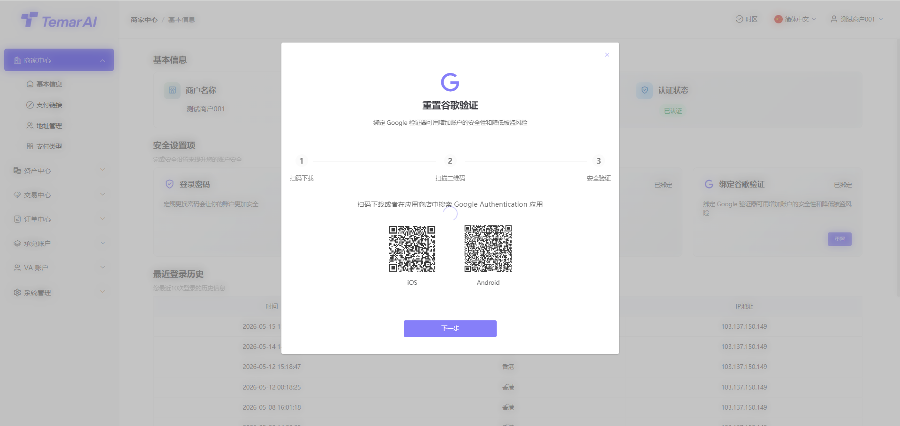

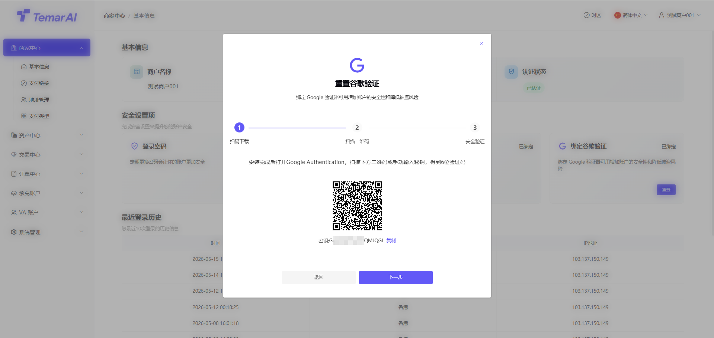

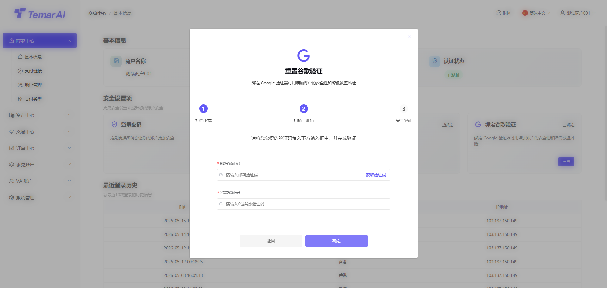

最近登录历史
功能描述：显示该商家账户最佳登录地区及IP信息，如发现在未知地区登录，请及时修改密码以及谷歌验证器。

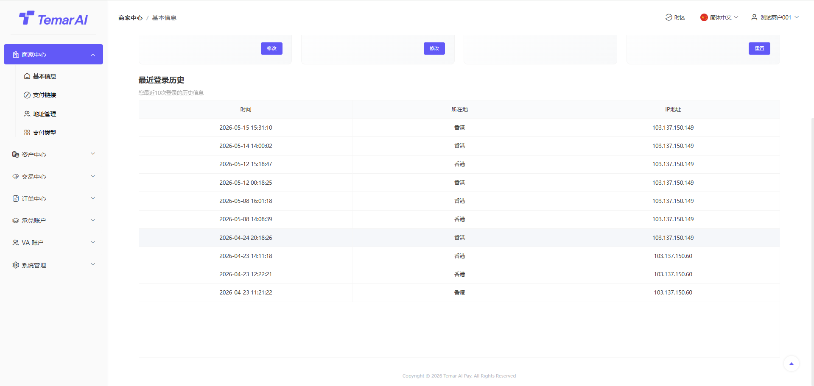

### 支付链接

链接列表
- 功能描述：本模块展示已创建的所有收款链接。

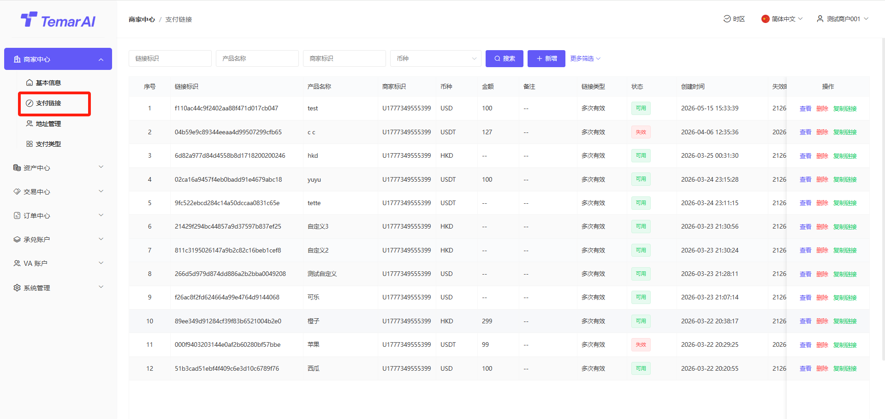

- 操作：
- 筛选：通过标识、产品名称、时间等条件进行筛选搜索。
- 查看：查看某个支付链接详细信息，以及支付链接对应订单。

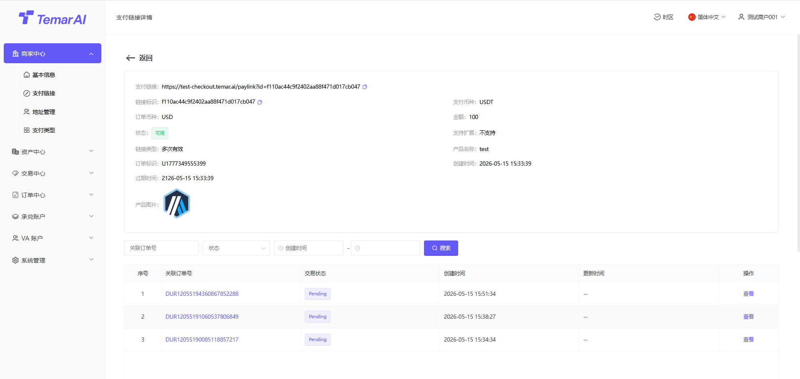

- 删除：删除链接后，该支付链接失效。
- 复制：点击“复制链接”按钮，即可将该URL分享给买家进行付款。
- 新增：生成一个面向买家的固定收款链接，并支持灵活配置参数，包含以下
- 链接基本信息：
产品名称、产品描述：将于支付收银页面展示所设置信息
图片：若不设置，则展示商家logo
高级设置：如配置后，用户在支付收银页面需要填写对应信息
计价币种：该支付链接用于计算价格币种
计价金额：用户需要支付的金额字段，如不填写则由用户在收银页面自己填写
- 链接配置：
类型：可选数币或法币（单选），用户实际支付时可使用支付方式
币种/金额：根据所选类型，选择具体币种及订单金额
链接类型：单次有效/多次有效，这将决定本链接可发起一次或可重复发起交易
链接有效期：当前支持4种方式，24h/48h/长期有效，自定义（半年内区间）

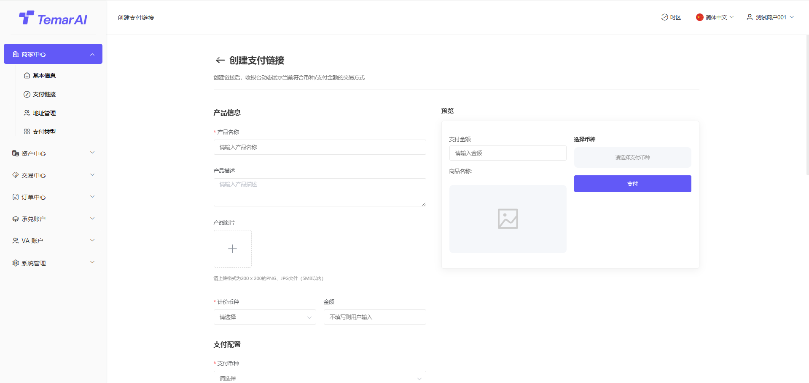

### 地址管理

功能描述：本模块用于商家管理其用于提现时接收法币和数字资产的收款地址。商户提交地址需要平台审核通过后，才能使用。

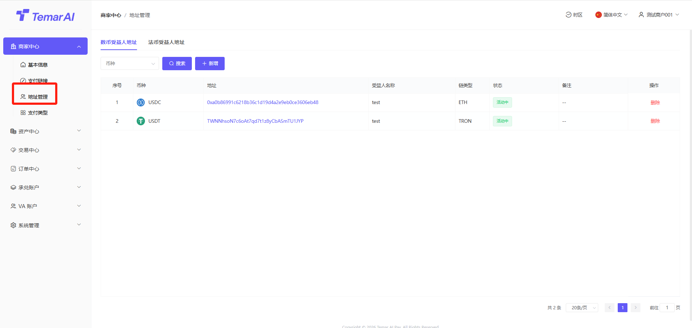

数字资产地址操作：
- 筛选：通过币种筛选搜索。
- 编辑：修改收款地址信息。
- 新增:
- 受益人名称：收款地址名称
- 币种：币种名称
- 链类型：该币种归属公链
- 币种地址：收款钱包地址。

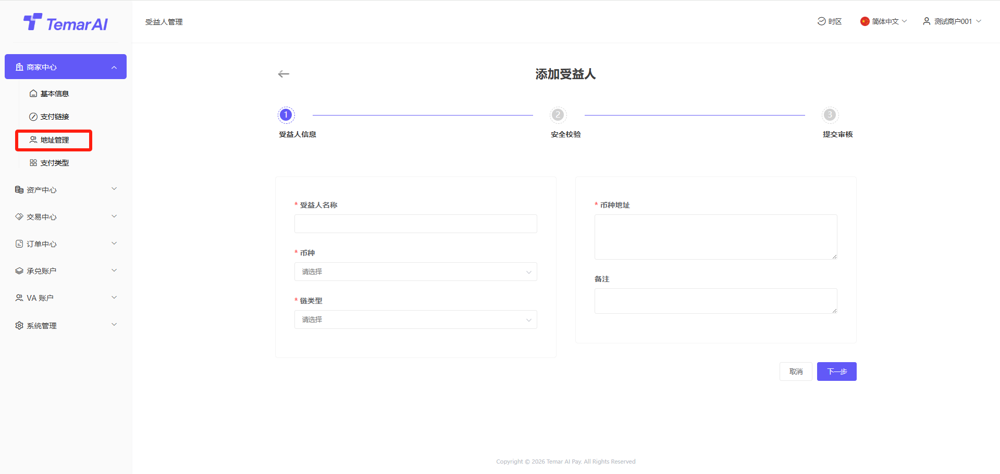

法币资产地址操作：
- 筛选：通过币种筛选搜索。
- 查看：查看已添加法币收款地址信息。

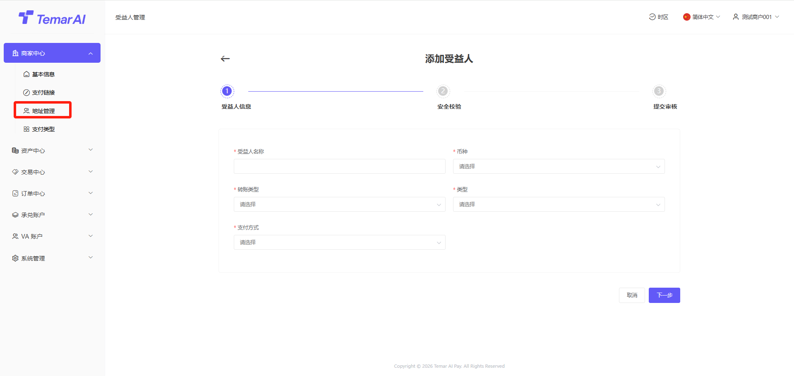

### 支付类型

功能描述：本模块用于商家查看已开通其支持的收款/付款币种及其对应的费率和结算规则。如需增加新币种请联系平台。

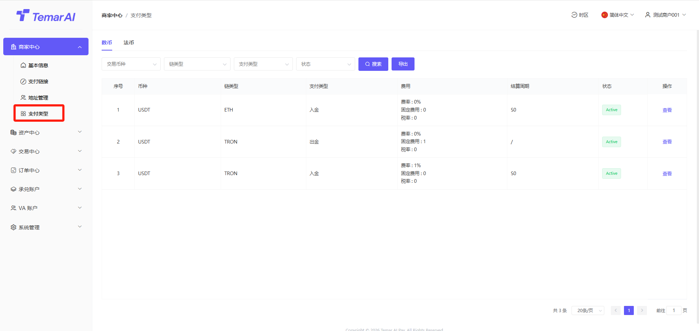

操作：
- 筛选：通过币种、支付类型、状态等进行搜索。
- 查看：查看单一币种的详细信息。