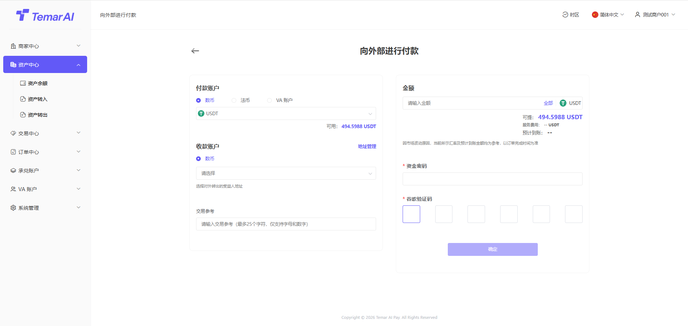
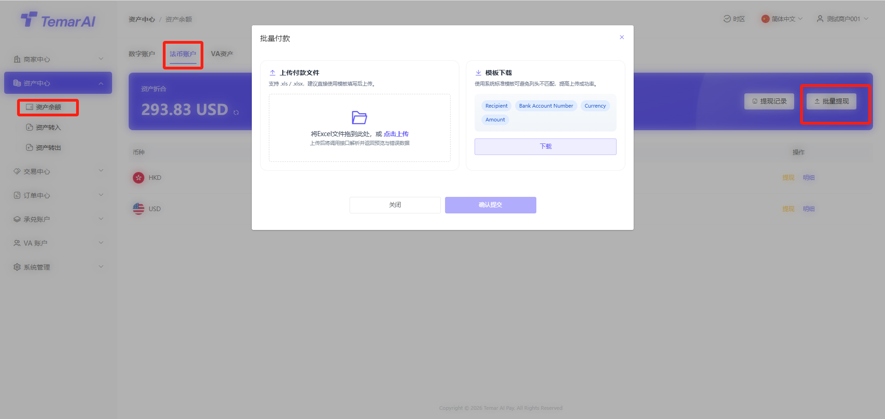
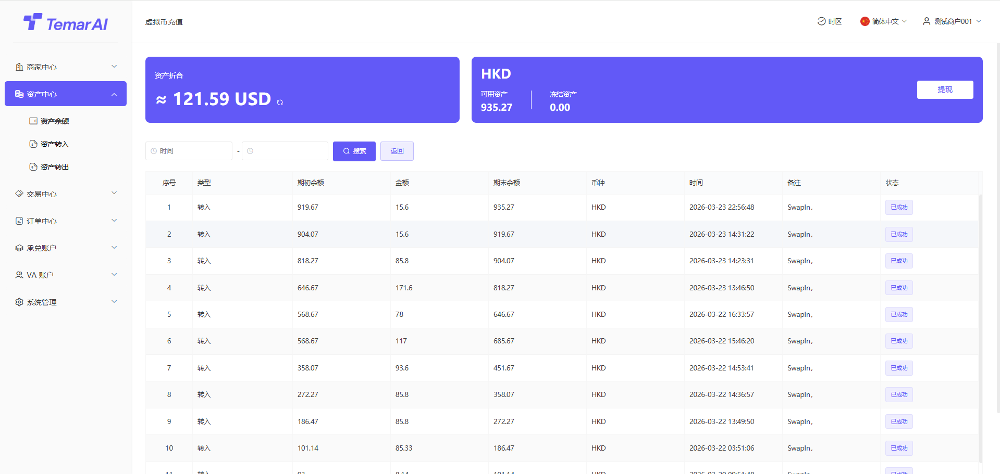
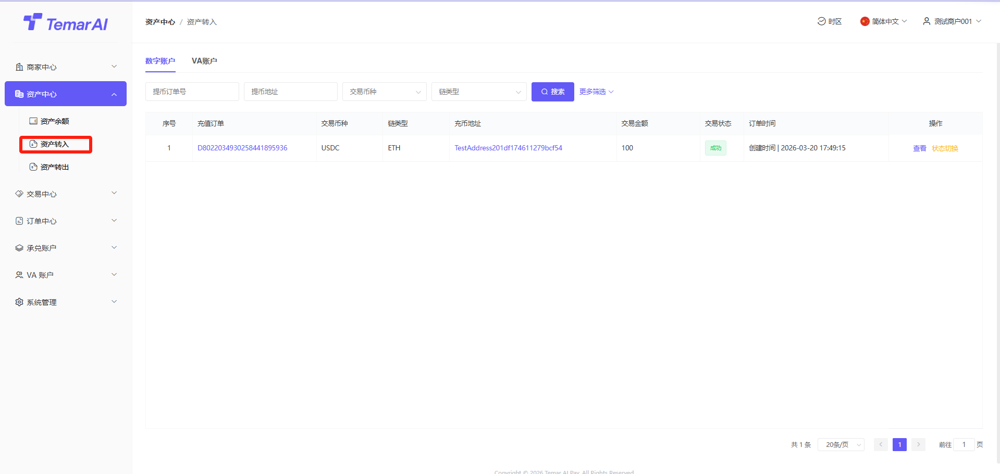

# 收款

收款是商家管理所有向用户收款（代收）订单、跟踪资金状态的核心功能模块�?

链接列表

功能描述：本模块展示已创建的所有收款链接�?

操作�?

筛选：通过标识、产品名称、时间等条件进行筛选搜索�?

查看：查看某个支付链接详细信息，以及支付链接对应订单�?

删除：删除链接后，该支付链接失效�?

复制：点击“复制链接”按钮，即可将该URL分享给买家进行付款�?

新增：生成一个面向买家的固定收款链接，并支持灵活配置参数，包含以�?

链接基本信息�?

产品名称、产品描述：将于支付收银页面展示所设置信息

图片：若不设置，则展示商家logo

高级设置：如配置后，用户在支付收银页面需要填写对应信�?

计价币种：该支付链接用于计算价格币种

计价金额：用户需要支付的金额字段，如不填写则由用户在收银页面自己填写

链接配置�?

类型：可选数币或法币（单选），用户实际支付时可使用支付方�?

币种/金额：根据所选类型，选择具体币种及订单金�?

链接类型：单次有�?多次有效，这将决定本链接可发起一次或可重复发起交�?

链接有效期：当前支持4种方式，24h/48h/长期有效，自定义（半年内区间�?

功能描述：本页面集中展示您数字货币代收订单记录，便于查询、跟踪和管理。包含API下单以及支付链接下单数据�?

操作�?

筛选：订单号、类型、交易状态、时间搜索�?

查看：订单充值详细字段�?

订单状态：订单成功后，才会入账到商户冻结资产中�?

结算状态：结算变为成功时，才会入账到商户可用资产中�?

回调通知：回调成功后，表示已通知下游接口�?

切换状态：该操作仅沙河环境存在，用于API对接时，调试使用�?

尽情期待�?
