# U卡管理

平台支持开通虚拟卡、实体卡，同时兼容多子卡共用共享项目资产的共享卡/

U 卡资金链路总览

商户数币账户 → 划转至 U 卡账户 → U 卡账户下分两路：

路 1：直接充值到单张 U 卡（开卡费、手续费、单卡余额扣减）

路 2：充值到共享项目 → 共享项目下所有子卡共用同一资金池

资金只能从数币账户进来，U 卡账户不接收外部入金。

功能描述：

U 卡账户是商户在 U 卡体系下的资金载体，资金均有数币账户进来。U卡体系下开卡、手续费、充值都在该账户下扣除。

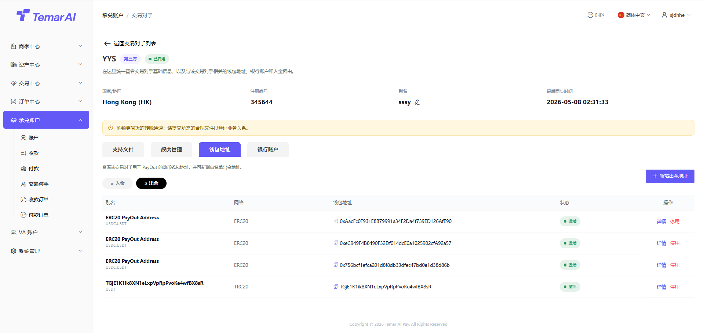

操作描述：

划转：支持数币账户资产与U卡账户资金划转。

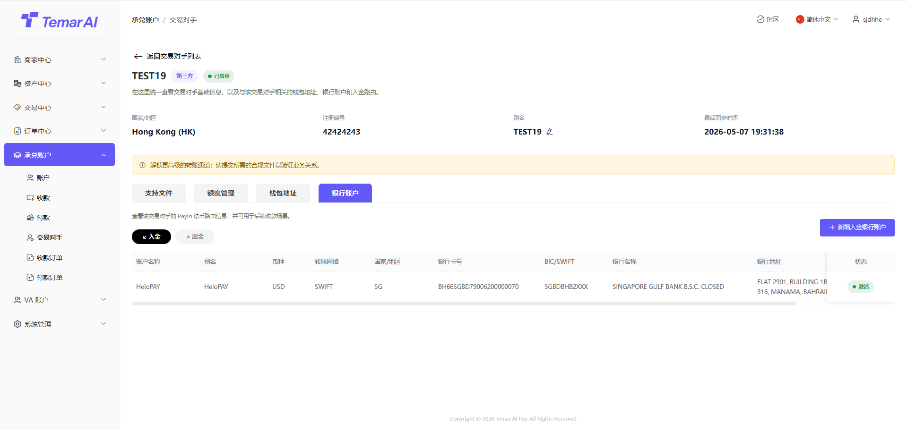

账户明细：查看U卡账户资金流水。

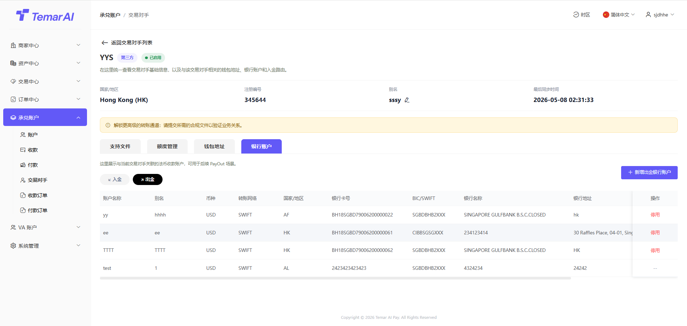

功能描述：

多张子卡共享同一项目资金池的机制，支持项目创建、子卡新增、项目充值/提现。

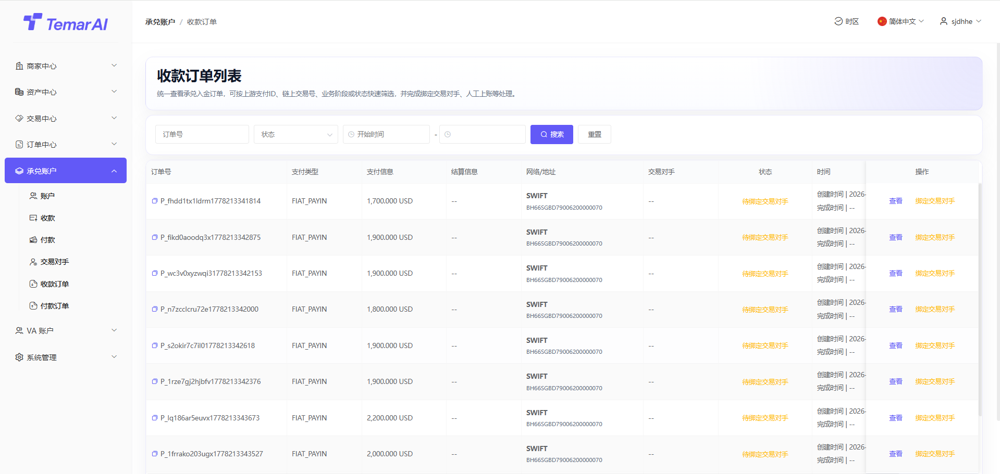

操作描述：

新增项目：共享项目 → 添加项目 → 填写名称/充值金额/选择卡段等 → 确认创建。

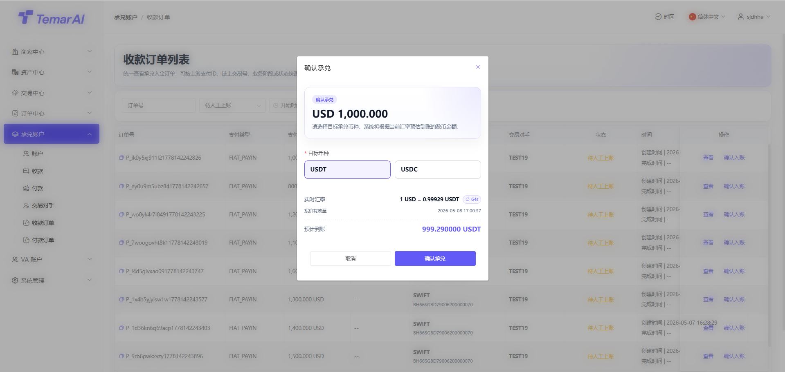

充值：共享项目 → 详情 → 充值 → 输入金额 → 确认。

转出：共享项目 → 详情 → 提现 → 输入金额 → 确认。

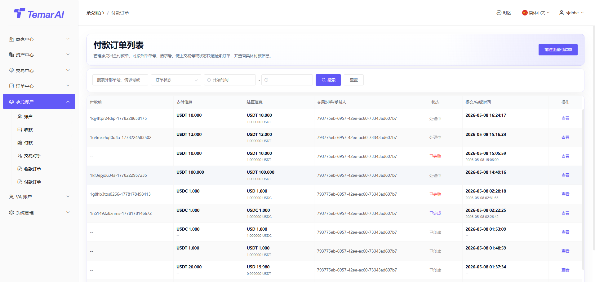

新增子卡：共享项目 →  添加共享卡 → 选择 U 卡→选择持卡人并配置消费额度 → 确认。

冻结/启用子卡：共享项目 → 详情 → 选择子卡 → 冻结/启用。冻结后子卡不可用。

冻结：共享项目 → 详情 → 更多 → 冻结。 冻结后所有子卡均不可用。

查看：

详情-子卡列表：查看所有子卡信息，以及管理子卡。

交易流水：显示共享项目的资金流水。

卡类型对比

维度

虚拟卡

实体卡

共享卡

开卡入口

卡片管理

卡片管理

共享项目（不在卡片管理开）

资金来源

U 卡账户

U 卡账户

共享项目资金池

适用场景

线上支付、即开即用

线下刷卡、实体邮寄

团队/项目共用资金

状态管理

冻结/解冻/注销

冻结/解冻/注销

在共享项目下管理

功能描述：

管理所有 U 卡（虚拟卡/实体卡）的全生命周期，包括开卡、状态管理、查询。列表会同时展示共享卡（共享卡的开卡及充值入口在「共享项目」模块，本模块仅支持查看与状态管理）。

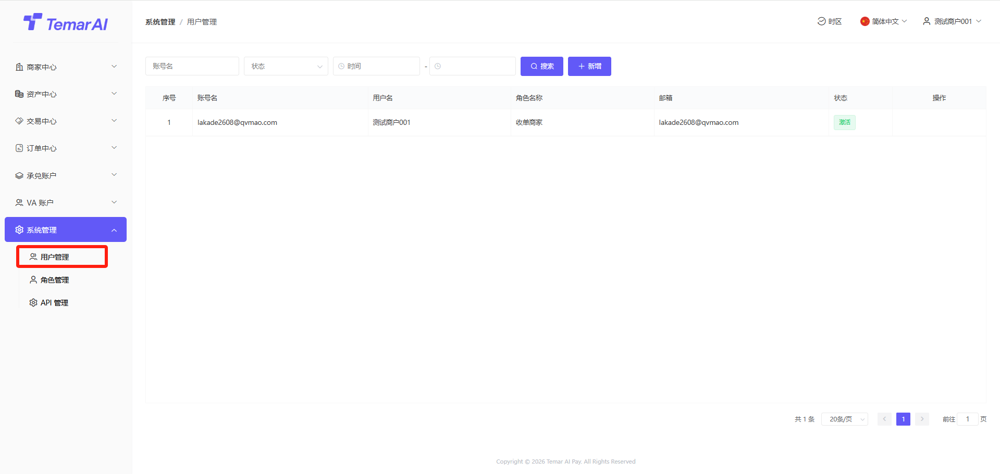

操作描述：

新增（开卡）：

实体卡：卡片管理 → 开卡 → 选择卡类型（虚拟卡/实体卡）→  选择卡 BIN/卡组织 → 选择持卡人 →输入卡号→ 设置pin → 确认开卡（系统自动扣开卡费）。

虚拟卡：卡片管理 → 开卡 → 选择卡类型（虚拟卡/实体卡） → 选择卡 BIN/卡组织→ 选择持卡人→ 充值金额 → 确认开卡（系统自动扣开卡费）。

ps：共享卡开卡通过共享项目下进行开卡。

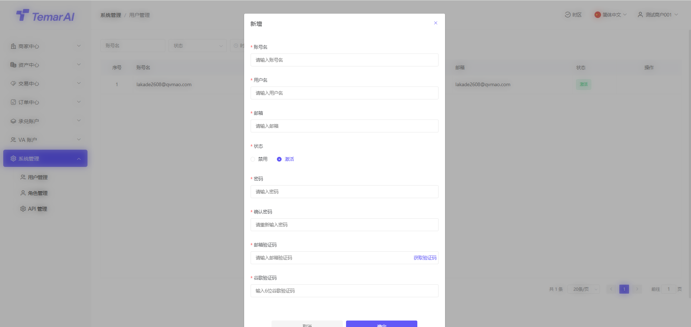

详情：卡片管理 → 列表 → 点击某张卡 → 查看完整信息（卡号/持卡人/余额/限额/状态/交易记录）。

状态变更：卡片管理 → 列表 → 操作列 →冻结/解冻/复制/注销。

充值：

常规卡：充值则扣除U卡账户资金

共享卡：修改总授信额度，并不调整资金。

转出：

常规卡：转出到U卡账户中。

共享卡：修改总授信额度，并不调整资金。

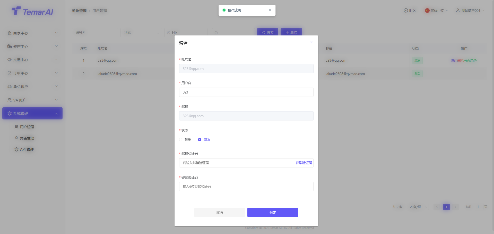

筛选：卡片管理 → 列表 → 按状态/卡类型/持卡人/卡号/所属项目筛选。

功能描述：

记录 U 卡在网络支付时触发的 3DS 二次验证信息，支持验证记录查询。

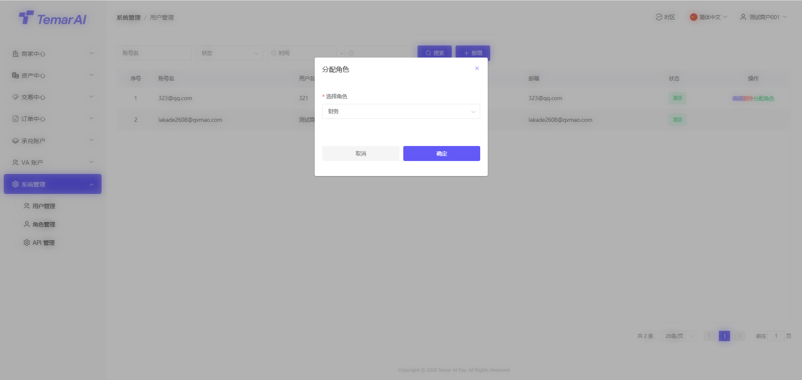

操作描述：

筛选：3DS 验证 → 验证记录 → 设置时间/卡号/持卡人/验证结果/金额范围 → 查询/导出。

功能描述：

查询 U 卡所有消费记录的入口，支持多维筛选、详情查看、导出对账。

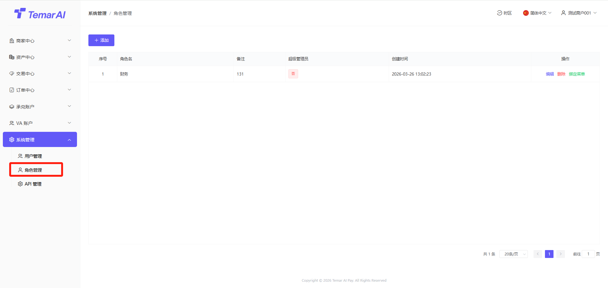

操作描述：

筛选：交易查询 → 列表 → 设置时间/卡号/持卡人/卡类型/所属项目/状态/类型/金额/商户/关键字 → 查询/导出。

功能描述：

管理 U 卡持卡人信息，是开卡的前置模块，需先创建持卡人。

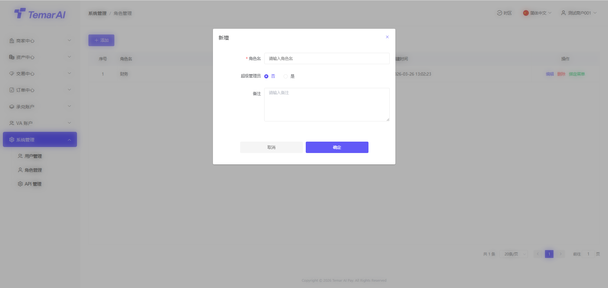

操作描述：

新增：持卡人管理 → 新增持卡人 → 填写基本信息（姓名/证件/手机/地址）→ 上传证件 → 提交。

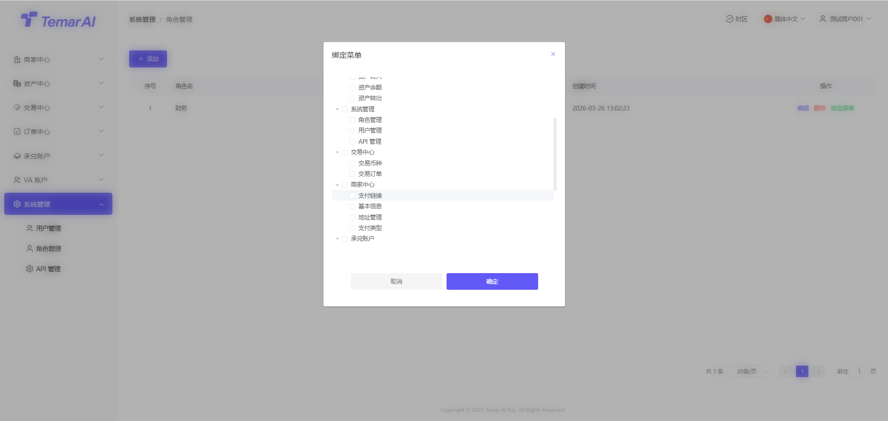

详情：查看完整信息及关联卡片。

冻结/启用： 停用/启用。

删除（注销）：持卡人管理 → 列表 → 操作列 → 注销（需先处理名下所有卡片）。

筛选：持卡人管理 → 列表 → 按 KYC 状态/国籍/持卡人状态/姓名/手机号/证件号筛选。
