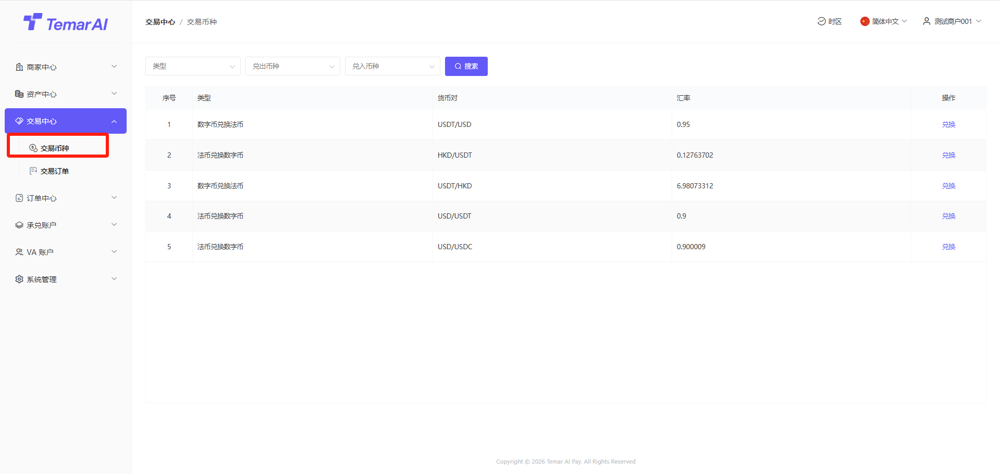
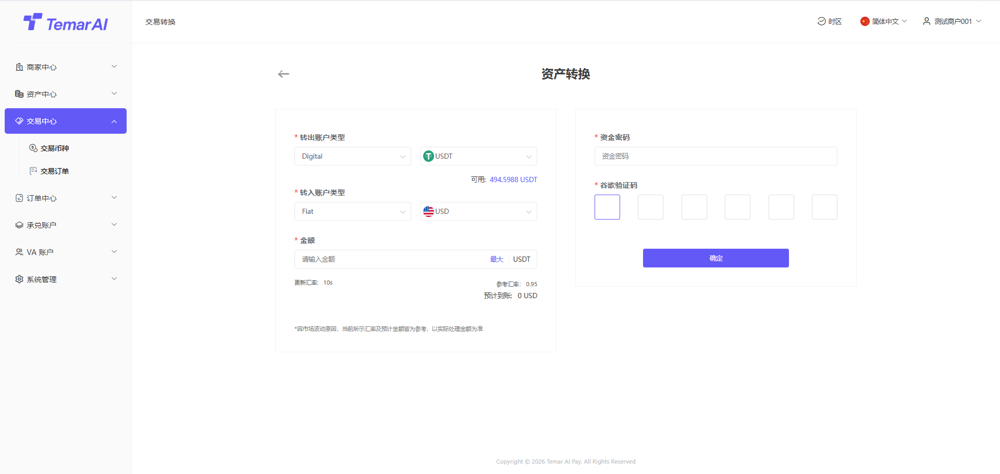
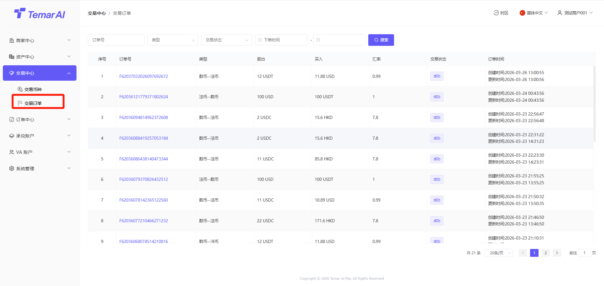

# 交易中心

交易中心模块是商家法币账户、数币账户进行币种兑换、查看汇率行情及管理所有兑换订单的功能集合。

交易币种
功能描述：本页面展示平台支持的所有币种兑换交易对，提供实时汇率信息，并允许商家进行币种兑换操作。

操作：
- 筛选：类型、币种搜索。
- 兑换：
选择交易类型：买入[目标币种] 或 卖出[基准币种]。
在“金额”框中输入您要付出的币种数量，系统会根据实时汇率在“获得”框中自动计算您将收到的币种数量。
确认显示的汇率、预计手续费和预计到账金额。
输入资金密码、谷歌验证后，点击“确认”按钮提交订单。

交易订单
功能描述：本页面集中展示您所有的币种兑换订单记录，便于查询、跟踪和管理。
操作：
- 筛选：订单号、类型、交易状态、时间搜索。

