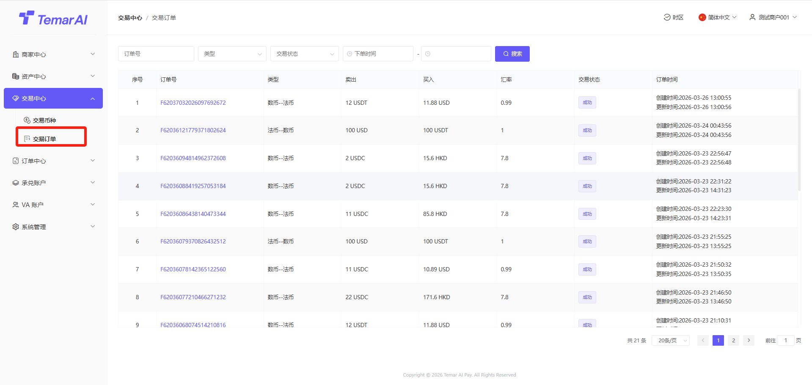

# 交易中心

交易中心模块是商家法币账户、数币账户进行币种兑换、查看汇率行情及管理所有兑换订单的功能集合ã€?

交易币种 功能描述：本页面展示平台支持的所有币种兑换交易对，提供实时汇率信息，并允许商家进行币种兑换操作ã€?

操作ï¼?

* 筛选：类型、币种搜索ã€?
* 兑换ï¼?选择交易类型：买入\[目标币种] æˆ?卖出\[基准币种]ã€?在“金额”框中输入您要付出的币种数量，系统会根据实时汇率在“获得”框中自动计算您将收到的币种数量ã€?确认显示的汇率、预计手续费和预计到账金额ã€?输入资金密码、谷歌验证后，点击“确认”按钮提交订单ã€?

交易订单 功能描述：本页面集中展示您所有的币种兑换订单记录，便于查询、跟踪和管理ã€?操作ï¼?

* 筛选：订单号、类型、交易状态、时间搜索ã€?

