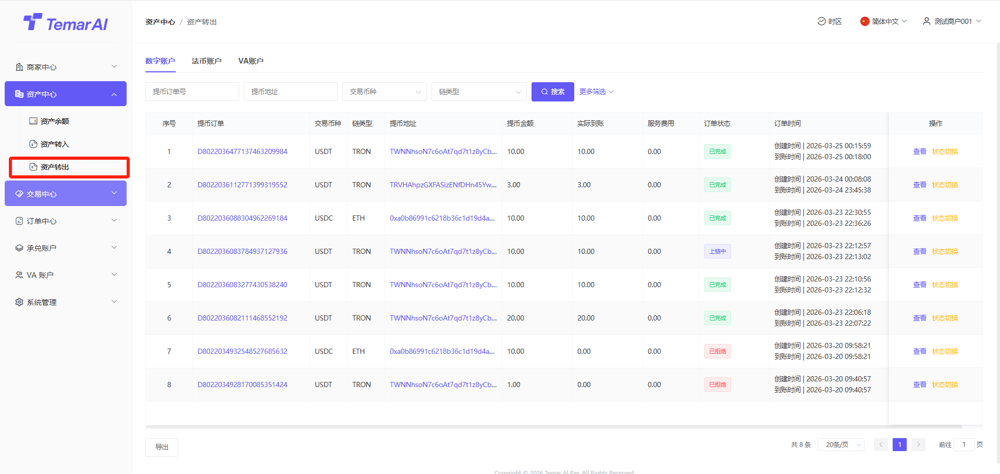
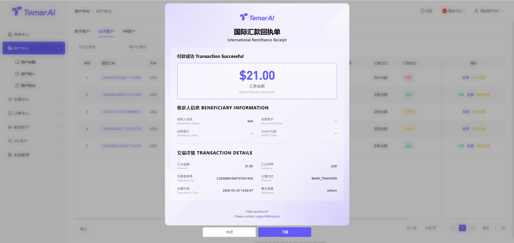
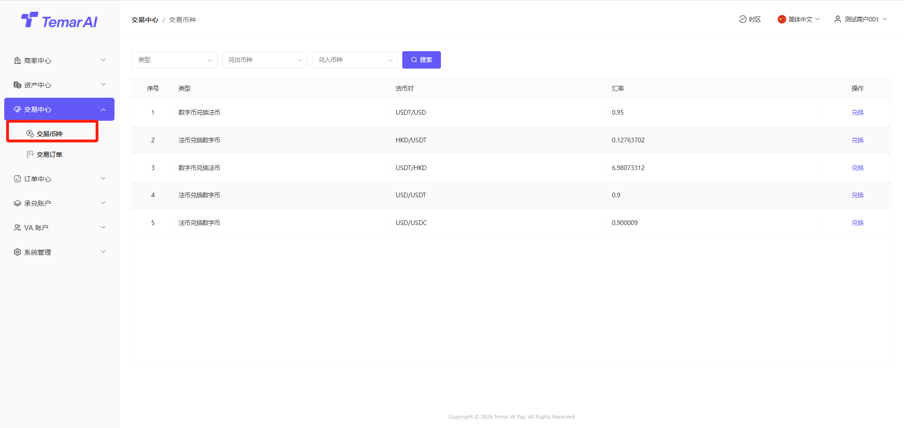
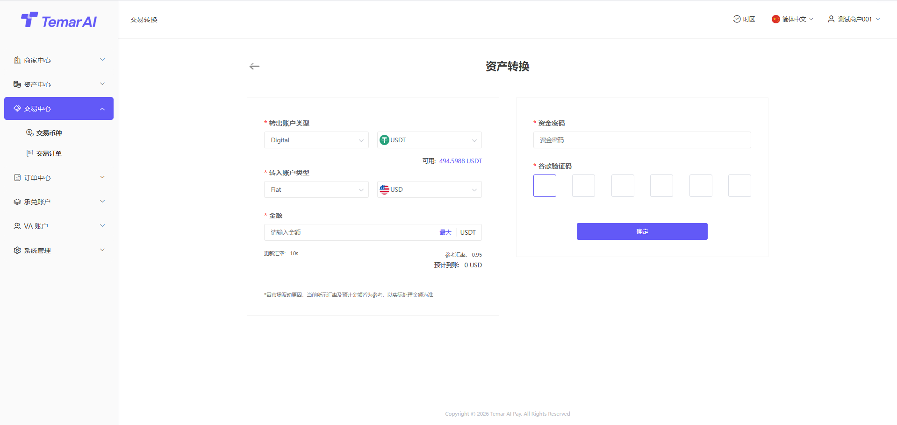

## 付款

付款是商家管理所有向用户付款（代付）订单、跟踪资金状态的核心功能模块ã€?

功能描述：本页面集中展示您数字货币代付订单记录，便于查询、跟踪和管理ã€?

操作ï¼?

筛选：订单号、类型、交易状态、时间搜索ã€?

查看：订单提现详细字段ã€?

订单状态：平台提交后，在链上确认成功后，订单变为完成中ã€?

回调通知：回调成功后，表示已通知下游接口ã€?

免审设置：可设置币种需要在商家后台进行审核，如不设置则均是免审ã€?

列表：显示设置币种免审数据ã€?

免审数量：高于该数字的提现订单均需要商家进行手工审核ã€?

币种：需要审核币ç§?

链类型：币种归属公链

状态：开启、关é—?

批量付款：下载模板进行填写批量付款收款信æ?

审核/批量审核：审核通过后，代付订单进行上链付款。审核不通过订单失败ã€?

切换状态：该操作仅沙河环境存在，用于API对接时，调试使用ã€?

尽情期待ï¼?
