# 商家中心

### 基本信息

该页面主要管理登录商家的基础安全信息以及最佳登录历史查看ã€?

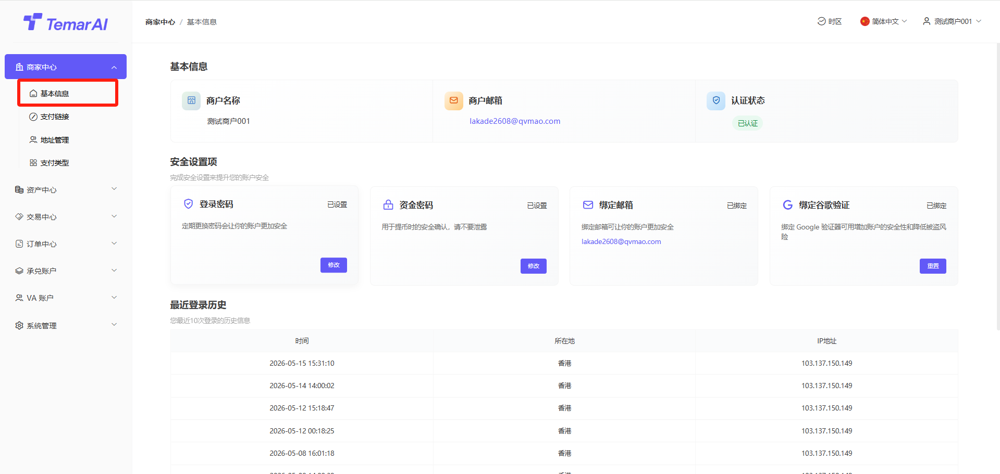

资料审核管理

* 功能描述：提交资料平台审核，当未提交资料时，权限较少ã€?
* 操作步骤ï¼?
* 点击“认证â€?
* 填写企业信息
* 填写联系人信æ?
* 提交审核
* 审核通过后，获得更多权限

登录密码管理

* 功能描述：修改登录商家后台的密码ã€?
* 操作步骤ï¼?
* 点击“修改登录密码”ã€?
* 设置新登录密码（输入长度ä¸?-18，数字字母大小写符号组合的密码）ã€?
* 再次输入新密码确认ã€?
* 输入邮件验证ç ?谷歌验证码进行身份验证ã€?
* 点击“确定”，密码修改即时生效ã€?

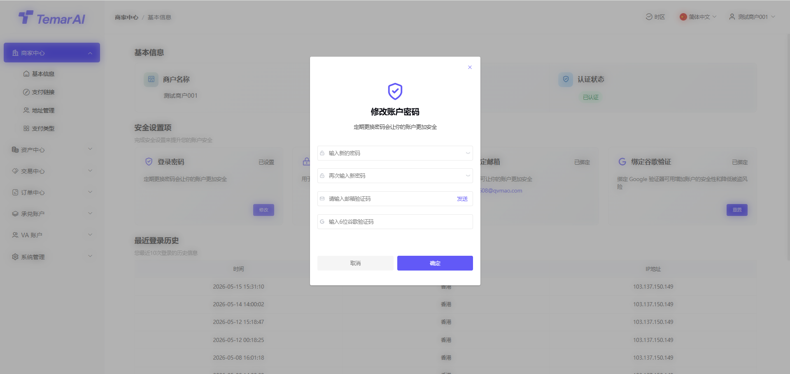

资金密码管理

* 功能描述：设置或修改用于提现等资金操作时的二次验证密码ã€?
* 操作步骤ï¼?
* 点击“修改资金密码”ã€?
* 设置新资金密码（输入长度ä¸?-18，数字字母大小写符号组合的密码）ã€?
* 再次输入新密码确认ã€?
* 输入邮件验证ç ?谷歌验证码进行身份验证ã€?
* 点击“确定”，密码修改即时生效ã€?

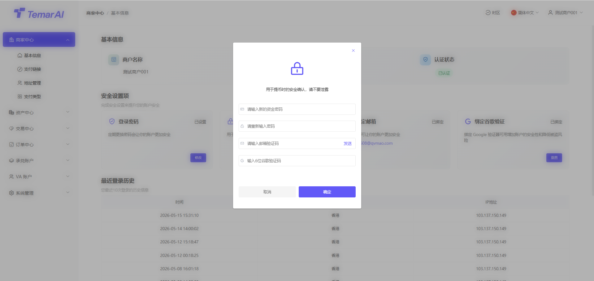

谷歌验证器绑å®?

* 功能描述：绑定谷歌验证器（Google Authenticator），为登录或关键操作增加动态口令（MFA）保护。默认首次登录必须绑定ã€?
* 如忘记原谷歌验证码，请联系平台进行重置ã€?
* 操作步骤ï¼?
* 点击“重置谷歌验证器”ã€?
* 使用谷歌验证器APP扫描页面上显示的二维码ã€?
* APP将生成一ä¸?位动态验证码ã€?
* 在页面输入框内填写该验证码ã€?
* 点击“下一步”，进行安全验证ã€?
* 输入邮件验证ç ?原谷歌验证码进行身份验证ã€?
* 确认成功后，重置谷歌成功ã€?

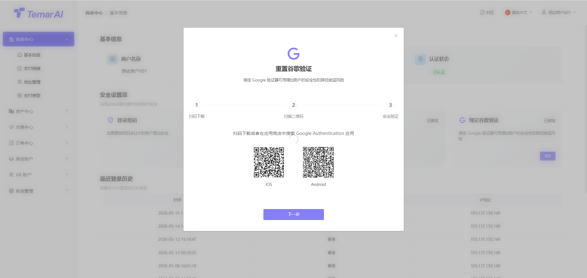

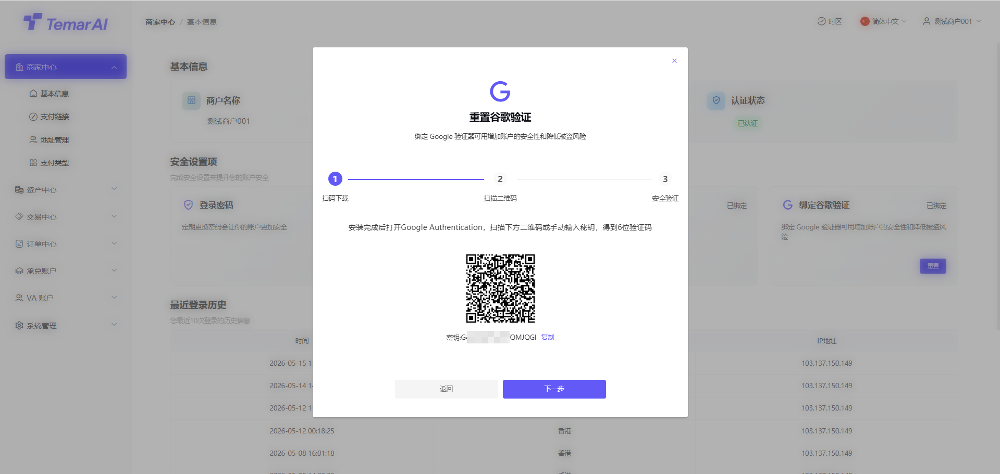

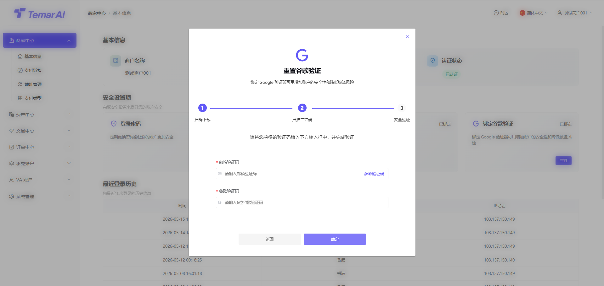

最近登录历å?功能描述：显示该商家账户最佳登录地区及IP信息，如发现在未知地区登录，请及时修改密码以及谷歌验证器ã€?

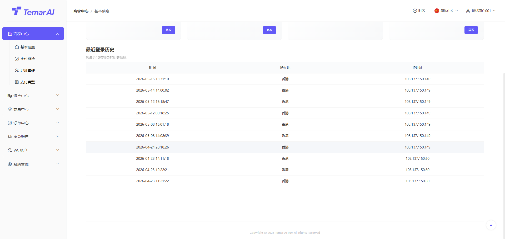

### 支付链接

链接列表

* 功能描述：本模块展示已创建的所有收款链接ã€?

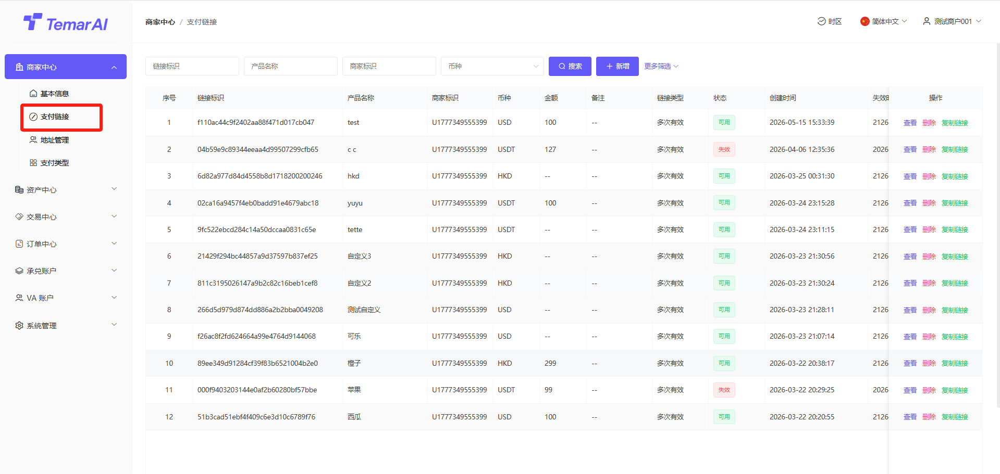

* 操作ï¼?
* 筛选：通过标识、产品名称、时间等条件进行筛选搜索ã€?
* 查看：查看某个支付链接详细信息，以及支付链接对应订单ã€?

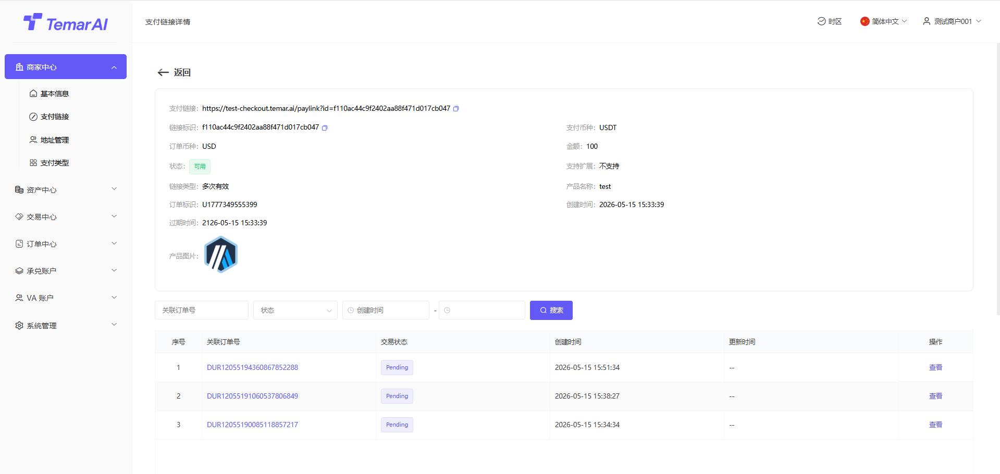

* 删除：删除链接后，该支付链接失效ã€?
* 复制：点击“复制链接”按钮，即可将该URL分享给买家进行付款ã€?
* 新增：生成一个面向买家的固定收款链接，并支持灵活配置参数，包含以ä¸?
* 链接基本信息ï¼?产品名称、产品描述：将于支付收银页面展示所设置信息 图片：若不设置，则展示商家logo 高级设置：如配置后，用户在支付收银页面需要填写对应信æ?计价币种：该支付链接用于计算价格币种 计价金额：用户需要支付的金额字段，如不填写则由用户在收银页面自己填写
* 链接配置ï¼?类型：可选数币或法币（单选），用户实际支付时可使用支付方å¼?币种/金额：根据所选类型，选择具体币种及订单金é¢?链接类型：单次有æ•?多次有效，这将决定本链接可发起一次或可重复发起交æ˜?链接有效期：当前支持4种方式，24h/48h/长期有效，自定义（半年内区间ï¼?

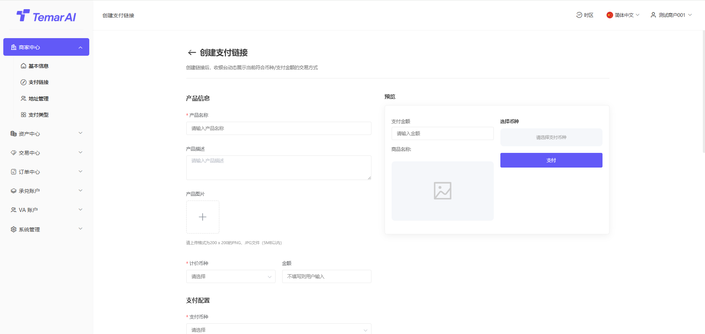

### 地址管理

功能描述：本模块用于商家管理其用于提现时接收法币和数字资产的收款地址。商户提交地址需要平台审核通过后，才能使用ã€?

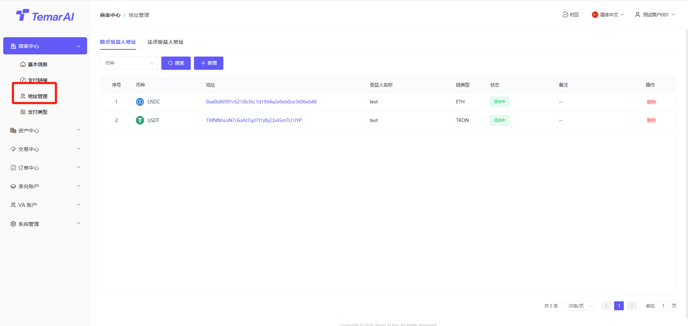

数字资产地址操作ï¼?

* 筛选：通过币种筛选搜索ã€?
* 编辑：修改收款地址信息ã€?
* 新增:
* 受益人名称：收款地址名称
* 币种：币种名ç§?
* 链类型：该币种归属公é“?
* 币种地址：收款钱包地址ã€?

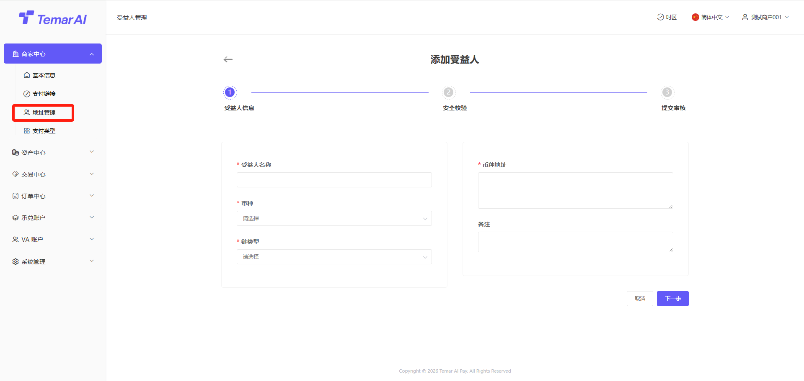

法币资产地址操作ï¼?

* 筛选：通过币种筛选搜索ã€?
* 查看：查看已添加法币收款地址信息ã€?

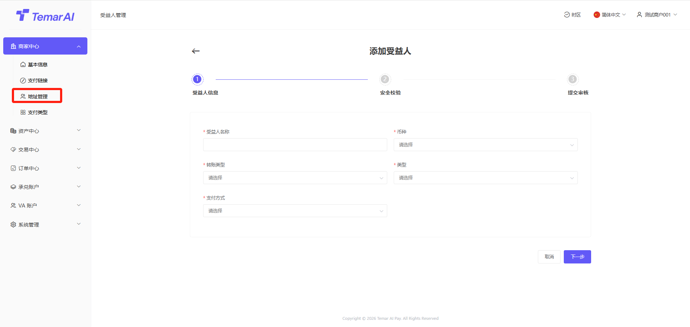

### 支付类型

功能描述：本模块用于商家查看已开通其支持的收æ¬?付款币种及其对应的费率和结算规则。如需增加新币种请联系平台ã€?

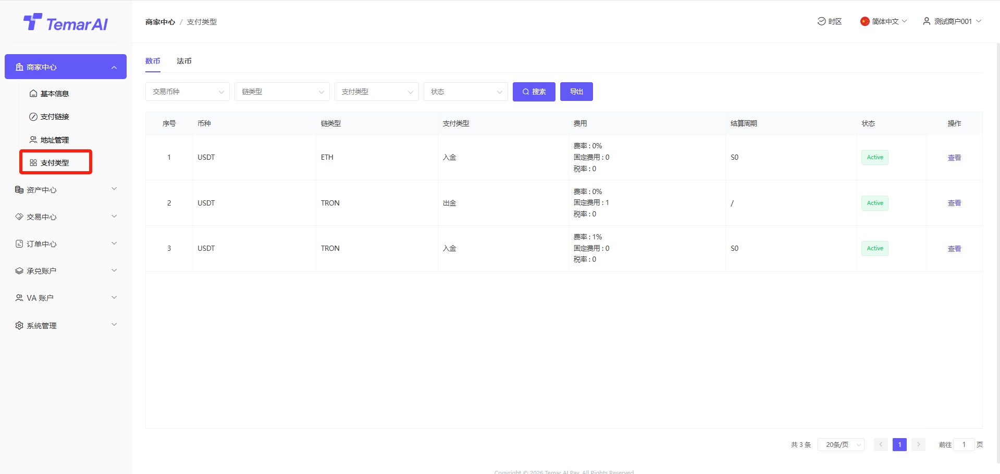

操作ï¼?

* 筛选：通过币种、支付类型、状态等进行搜索ã€?
* 查看：查看单一币种的详细信息ã€?
