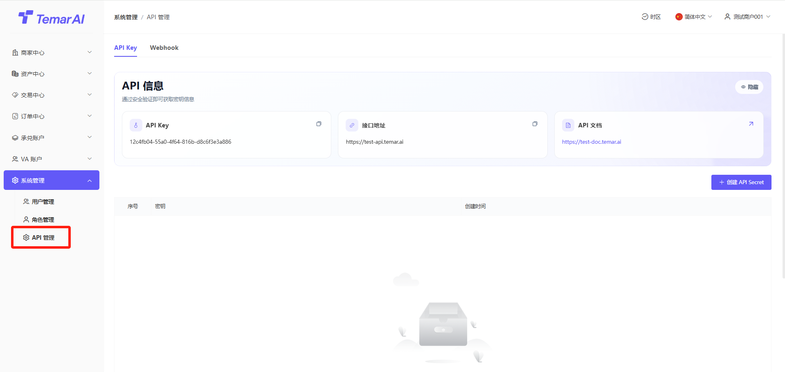
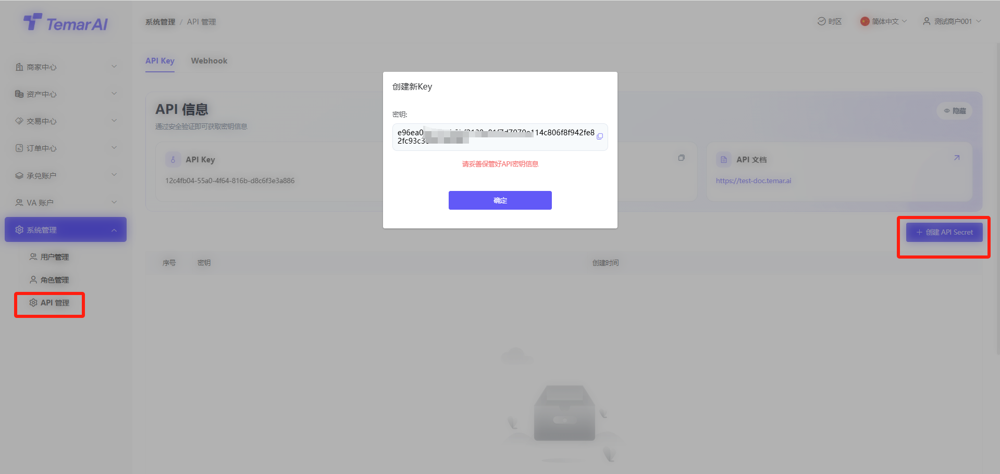
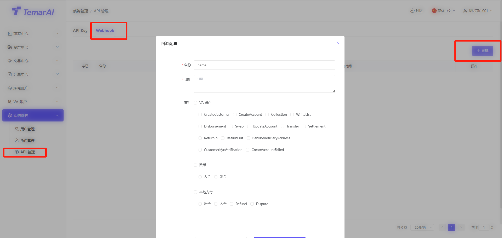
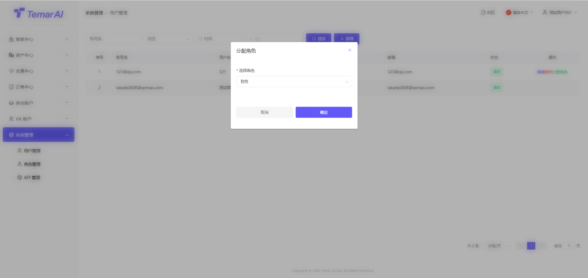
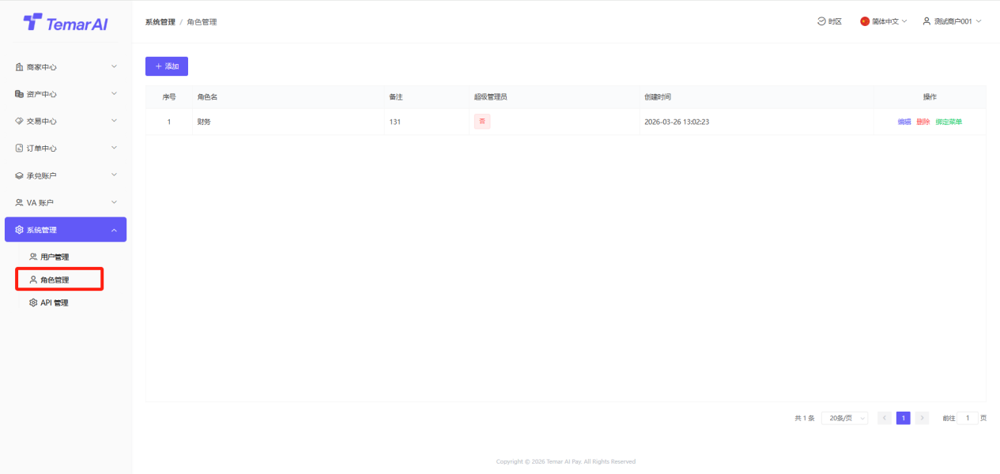
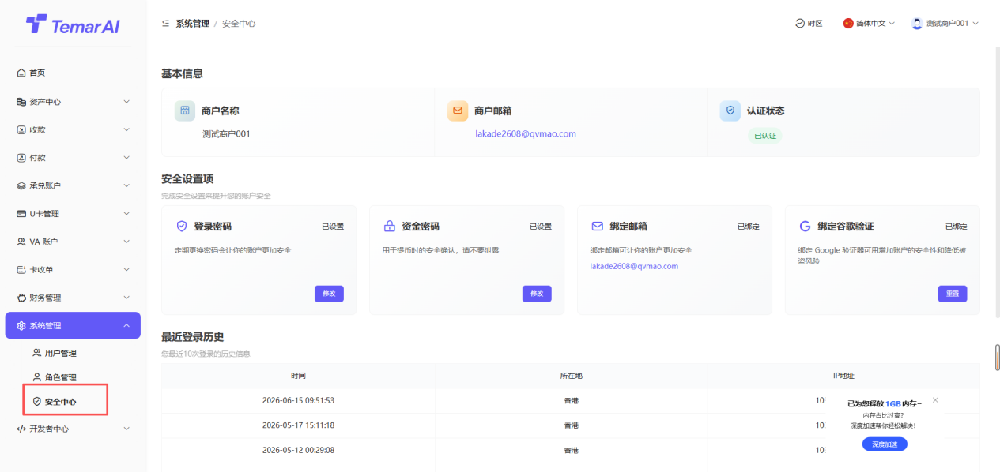
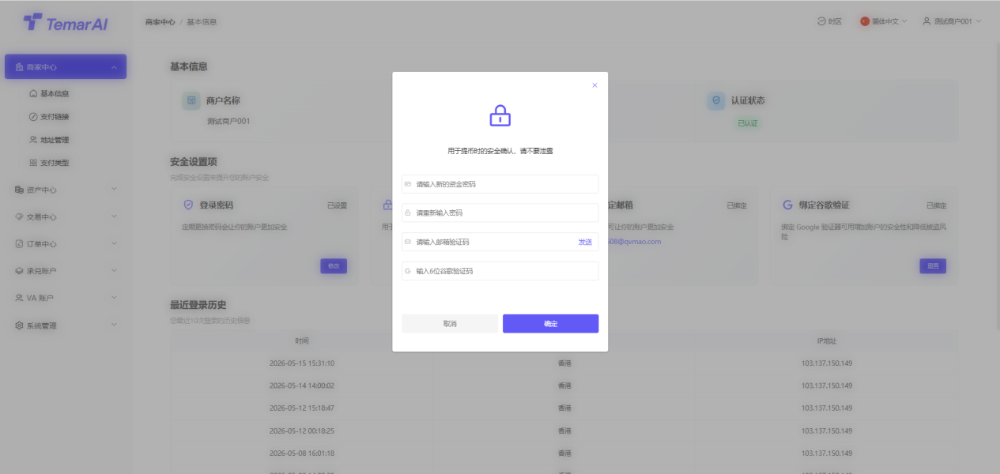
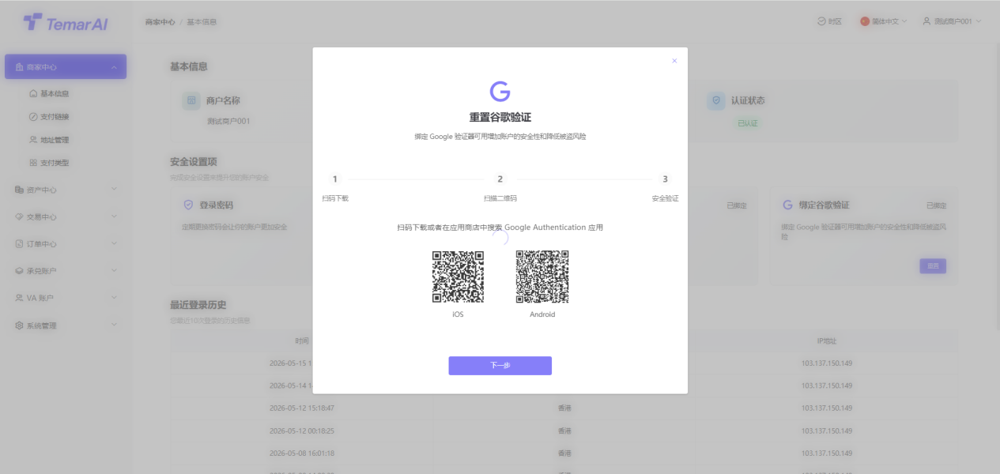

## 系统管理

系统管理板块是平台管理员进行全局配置、管理用户与权限、API管理、监控系统运行的后台中枢�?

功能描述：查看平台所有后台管理员账户信息，并进行账户状态管理�?

操作�?

筛选：账户名、状态、时间进行搜�?

新增�?

账户名：登录需要使用用户名建议和邮箱一�?

用户名：仅用于显示该用户名称

邮箱：用于敏感操作时，安全验证，会需要收验证�?

状态：禁用后，将无法登录商家后�?

密码：登录密码设�?

确认密码：重复输入登录密�?

谷歌验证码：验证当前登录账户谷歌验证码，用于安全验证

编辑：编辑用户名以及状�?

删除：删除用户后，用户无法登录商家后�?

分配角色：分配角色后，该用户拥有该角色对应权�?

·

功能描述：查看平台所有后台角色信息，并进行角色权限管理�?

操作�?

新增：创建角色名，用于该角色权限。例如：财务、运营等

超级管理�?默认选否即可

编辑：编辑已创建角色信息

删除：删除角色后，绑定该角色的用户将无任何权�?

绑定菜单：角色绑定菜单，对应绑定角色用户才能进入管理及查看该菜单

该页面主要管理登录商家的基础安全信息以及最佳登录历史查看�?

资料审核管理

功能描述：提交资料平台审核，当未提交资料时，权限较少�?

操作步骤�?

点击“认证�?

填写企业信息

填写联系人信�?

提交审核

审核通过后，获得更多权限

登录密码管理

功能描述：修改登录商家后台的密码�?

操作步骤�?

点击“修改登录密码”�?

设置新登录密码（输入长度�?-18，数字字母大小写符号组合的密码）�?

再次输入新密码确认�?

输入邮件验证�?谷歌验证码进行身份验证�?

点击“确定”，密码修改即时生效�?

资金密码管理

功能描述：设置或修改用于提现等资金操作时的二次验证密码�?

操作步骤�?

点击“修改资金密码”�?

设置新资金密码（输入长度�?-18，数字字母大小写符号组合的密码）�?

再次输入新密码确认�?

输入邮件验证�?谷歌验证码进行身份验证�?

点击“确定”，密码修改即时生效�?

谷歌验证器绑�?

功能描述：绑定谷歌验证器（Google Authenticator），为登录或关键操作增加动态口令（MFA）保护。默认首次登录必须绑定�?

如忘记原谷歌验证码，请联系平台进行重置�?

操作步骤�?

点击“重置谷歌验证器”�?

使用谷歌验证器APP扫描页面上显示的二维码�?

APP将生成一�?位动态验证码�?

在页面输入框内填写该验证码�?

点击“下一步”，进行安全验证�?

输入邮件验证�?原谷歌验证码进行身份验证�?

确认成功后，重置谷歌成功�?

最近登录历�?

功能描述：显示该商家账户最佳登录地区及IP信息，如发现在未知地区登录，请及时修改密码以及谷歌验证器�?

