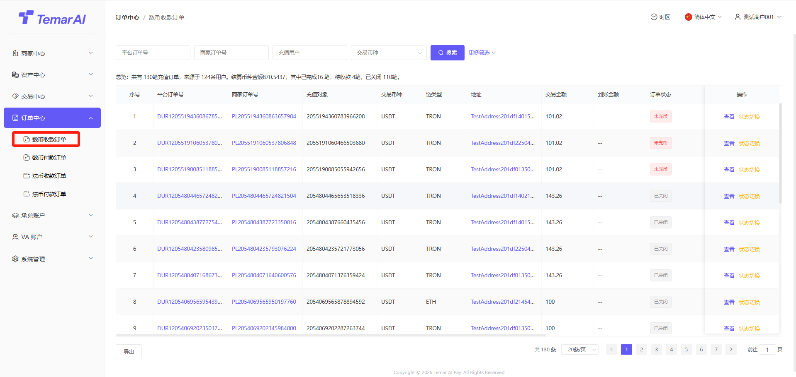
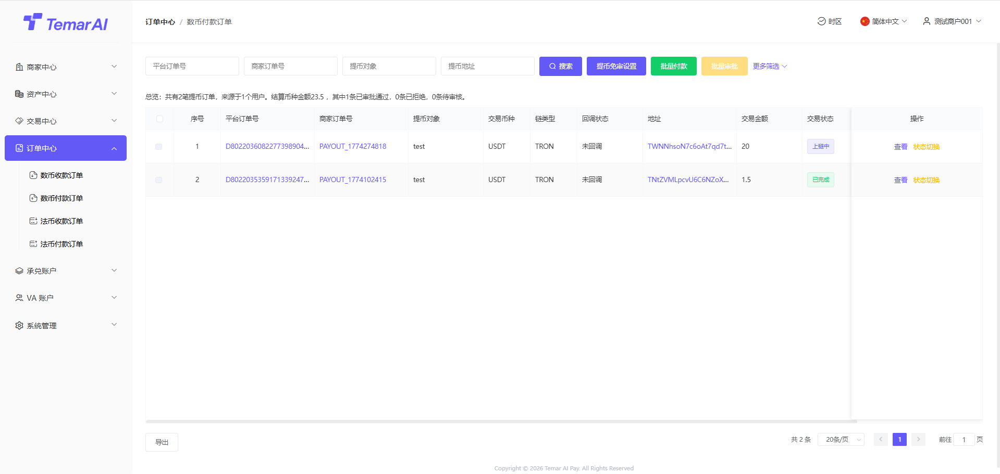
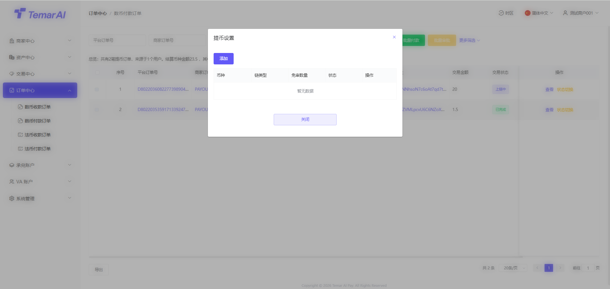
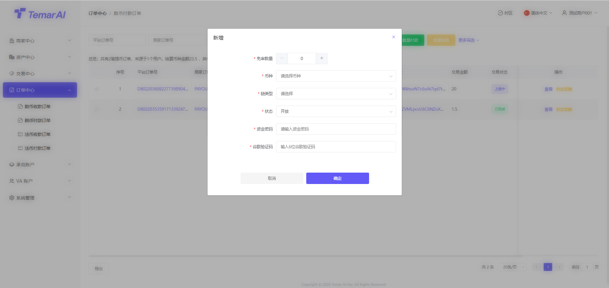
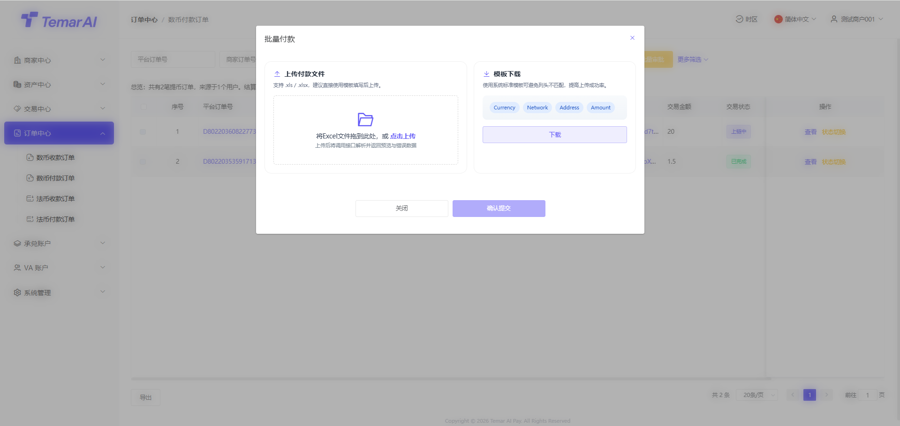

# 订单中心

订单中心是商家管理所有向用户收款（代收）与向用户付款（代付）的订单、跟踪资金状态的核心功能模块。

### 数币收款订单

功能描述：本页面集中展示您数字货币代收订单记录，便于查询、跟踪和管理。包含API下单以及支付链接下单数据。

操作：

* 筛选：订单号、类型、交易状态、时间搜索。
* 查看：订单充值详细字段。
* 订单状态：订单成功后，才会入账到商户冻结资产中。
* 结算状态：结算变为成功时，才会入账到商户可用资产中。
* 回调通知：回调成功后，表示已通知下游接口。
* 切换状态：该操作仅沙河环境存在，用于API对接时，调试使用。

### 数币付款订单

功能描述：本页面集中展示您数字货币代付订单记录，便于查询、跟踪和管理。

操作：

* 筛选：订单号、类型、交易状态、时间搜索。
* 查看：订单提现详细字段。
* 订单状态：平台提交后，在链上确认成功后，订单变为完成中。
* 回调通知：回调成功后，表示已通知下游接口。
* 免审设置：可设置币种需要在商家后台进行审核，如不设置则均是免审。
* 列表：显示设置币种免审数据。
* 免审数量：高于该数字的提现订单均需要商家进行手工审核。
* 币种：需要审核币种
* 链类型：币种归属公链
* 状态：开启、关闭

* 批量付款：下载模板进行填写批量付款收款信息

* 审核/批量审核：审核通过后，代付订单进行上链付款。审核不通过订单失败。
* 切换状态：该操作仅沙河环境存在，用于API对接时，调试使用。

### 法币收款订单

尽情期待！

### 法币付款订单

尽情期待！
