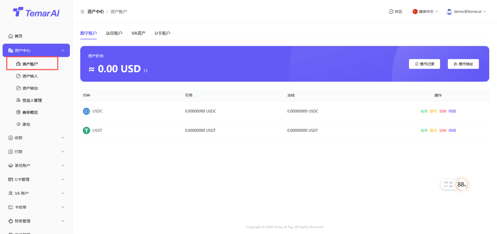
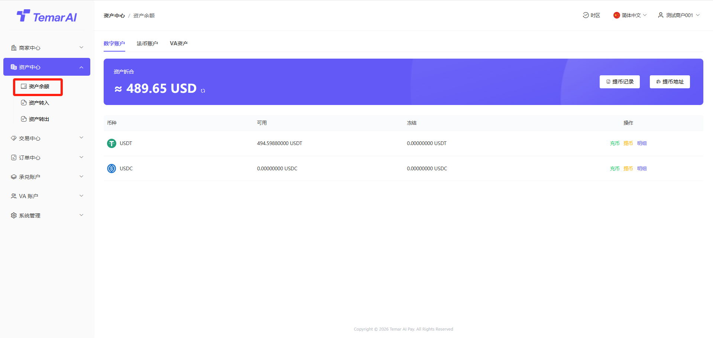
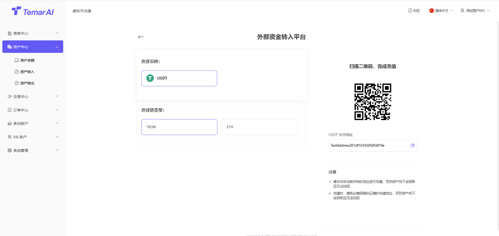

## 资产中心

资产中心主要用于管理商户资金ã€?

功能描述：本页面集中展示商家在平台的所有资产余额概览，并提供法币、数字币的充值与提现入口。VA账户（开发中，尽情期待！ï¼?

操作ï¼?

查看资产概览ï¼?

进入页面后，系统以列表形式分类展示以下资产余额：

法币资产：按不同币种（如CNY、USD等）分别显示“可用余额”、“冻结金额”、“滚动保证金”ã€?

数字资产：按不同币种（如USDT、BTC等）分别显示“可用余额”、“冻结金额”ã€?

VA账户：敬请期å¾?

U卡账户：只有USDT，用于开卡、卡充值等能力ã€?

充值操作：

在对应币种的资产卡片上，点击“充值”按钮ã€?

系统将根据币种类型引导至不同充值流程：

法币充值：暂不支持ã€?

数字币充值：系统将生成一个专属的充值地址（或二维码），商家向该地址转账即可ã€?

提现操作ï¼?

在对应币种的资产卡片上，点击“提çŽ?提币”按钮ã€?

系统将引导至“向外部进行付款”页面，并预选相应币种，商家需填写提现金额、选择收款地址等信息验证资金密码及谷歌验证并提交申请ã€?

法币提现ï¼?

指定付款äº?可不选，指定付款人时，手续费会更高ã€?

批量提现操作

法币账户板块才能进行批量提现操作

exc填写得信息，必须是已审核得法币提币地址信息

明细：查看某个币种资产的资金流水ã€?

功能描述：本页面用于查询和管理所有商家数字币的充值记录，便于商家核对入账情况。法å¸?VA账户充值暂不支持ã€?

操作ï¼?

筛选：订单号、地址、订单状态、时间等搜索ã€?

查看：查看充值详细信息ã€?

功能描述：本页面用于查询和管理所有法币与数字币的提现记录ã€?

操作ï¼?

查看：查看法币、数币的商家提现记录。VA账户尽情期待ï¼?

筛选：订单号、地址、订单状态、时间等搜索ã€?

查看：查看充值详细信息ã€?

水单：当有法币转出时，订单状态已完成，可查看以及下载水单ã€?

功能描述：本模块用于商家管理其用于提现时接收法币和数字资产的收款地址以及法币指定付款人管理。商户提交地址需要平台审核通过后，才能使用ã€?

数字资产地址操作ï¼?

筛选：通过币种筛选搜索ã€?

编辑：修改收款地址信息ã€?

新增:

受益人名称：收款地址名称

币种：币种名ç§?

链类型：该币种归属公é“?

币种地址：收款钱包地址ã€?

法币资产地址操作ï¼?

筛选：通过币种筛选搜索ã€?

查看：查看已添加法币收款地址信息ã€?

新增:新增法币收款银行信息ã€?

付款人操作：

筛选：通过币种、姓名、国家等筛选搜索ã€?

查看：查看已添加法币收款地址信息ã€?

新增：新增指定付款人

功能描述：本模块用于商家查看已开通其支持的收æ¬?付款币种及其对应的费率和结算规则。如需增加新币种请联系平台ã€?

操作ï¼?

筛选：通过币种、支付类型、状态等进行搜索ã€?

查看：查看单一币种的详细信息ã€?

商家法币账户、数币账户进行币种兑换、查看汇率行情及管理所有兑换订单的功能集合ã€?

功能描述：本页面展示平台支持的所有币种兑换交易对，提供实时汇率信息，并允许商家进行币种兑换操作ã€?

操作ï¼?

筛选：类型、币种搜索ã€?

兑换ï¼?

选择交易类型：买入[目标币种] æˆ?卖出[基准币种]ã€?

在“金额”框中输入您要付出的币种数量，系统会根据实时汇率在“获得”框中自动计算您将收到的币种数量ã€?

确认显示的汇率、预计手续费和预计到账金额ã€?

输入资金密码、谷歌验证后，点击“确认”按钮提交订单ã€?

功能描述：本页面集中展示您所有的币种兑换订单记录，便于查询、跟踪和管理ã€?

操作ï¼?

筛选：订单号、类型、交易状态、时间搜索ã€?

